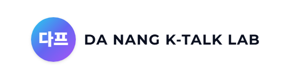
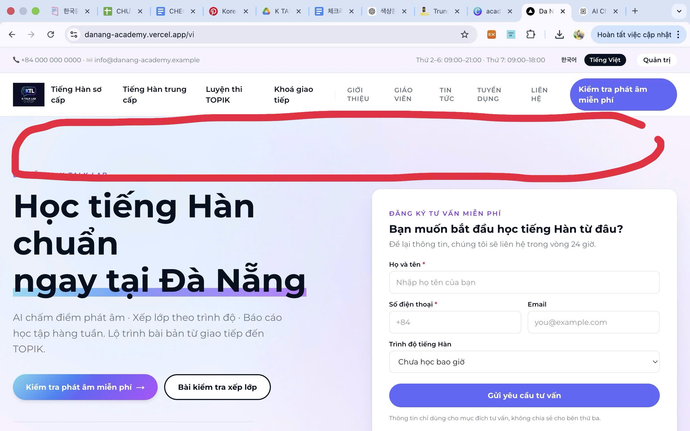
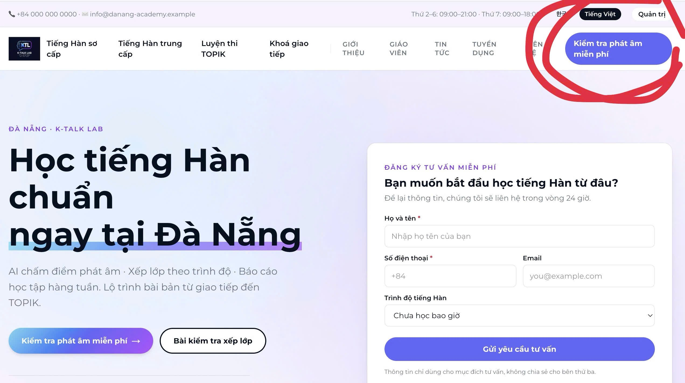

# 레퍼런스 사이트
https://hikorean.edu.vn/

1. 웹사이트 구조
 상단 메뉴 (Header – 항상 고정)
다음 4개 주요 강의를 기본으로 노출해 주세요:
* 초급 한국어
* 중급 한국어
* TOPIK 대비반
* 한국어 회화

2. 세로 메뉴 / 보조 기능
* 발음 테스트
* 수업 배정
* 상담 문의

3. 메인 콘텐츠 (Homepage – 중앙 영역)
발음 테스트 기능을 가장 핵심적으로 강조해 주세요.
* 메인 중앙에 배치
* 큰 버튼 또는 배너 형태로 디자인
* 사용자가 즉시 클릭하고 싶도록 시각적으로 눈에 띄게 구성

5. 사용자 경험 (UX)
* 접속 후 3~5초 내에 이해 가능한 구조
* 주요 버튼(수강 신청, 발음 테스트 등)이 명확하게 보이도록 디자인
* 복잡하지 않고 직관적인 동선
* 중학생 대상이므로 텍스트는 간결하게 구성

6.  Footer (하단 정보)
다음 정보를 포함해 주세요:
* 주소
* 전화번호
* Facebook
* Instagram
* 기타 연락 채널 (필요 시)

# 

https://hikorean.edu.vn/ 이거랑 비슷하게 가라고 했는데 완전 다른 사이트네?
https://hikorean.edu.vn/ 를 메인페이지로 생각해줘. 즉, 소개 사이트이자 + 우리 최초 기획에서와 같이 레벨테스트 및 대시보드 기능까지 있는 거라고 보면돼.

우선 지금 만든 사이트는 너무 AI 틱한데, 너한테 요청할게 있어.
(1) 최근에 클로드 디자인이 나왔던데, 너가 능동적으로 https://hikorean.edu.vn/ 와 같게 만들어 줄 수 있니? 계속 따라하면서 말야. 기존에는 playwright 등으로 스샷 찍어가면서 너가 능동적으로 작업할 수 있게 지시했는데, 클로드 디자인이 혹시 그런 기능을 대체할 수 있다면 그렇게 해도 좋아.

(2) 웹사이트는 https://hikorean.edu.vn/ 베이스이고, 별도 대시보드 등 학원 운영관리에 관한 섹션도 염두해서 만들면 좋을거 같아. 우선 베이스는 https://hikorean.edu.vn/ 를 따라가.

# 
근데 한국어/베트남 다국어로 만들어줘. 라이브러리 있지? n18i 이였나? 가장 적절한 스택을 너가 정해서 써줘

# 2026.04.27
프롬프트 지시 위치 : _docs/prompts/01-홈페이지구축/logo.png

### 홈페이지 색상 변경
현재 노란색 톤의 홈페이지인데, 컬러감을 이 로고와 맞춰줘

파란, 보라, 흰색의 컬러감 보이지?

여기에 로고도 넣어줘

이 로고 public/logo.png

# 2026.04.29

이렇게 위쪽에 public/main-banner.png 이미지를 넣어주실 수 있나요?
그리고 학습자가 클릭하면 바로 발음 테스트를 진행할 수 있도록 링크를 연결해 주실 수 있을까요?

위쪽에 이미 링크를 넣으셨다면 이 부분의 기능은 삭제해도 될 것 같습니다. 이렇게 하면 중복될 것 같아요.
